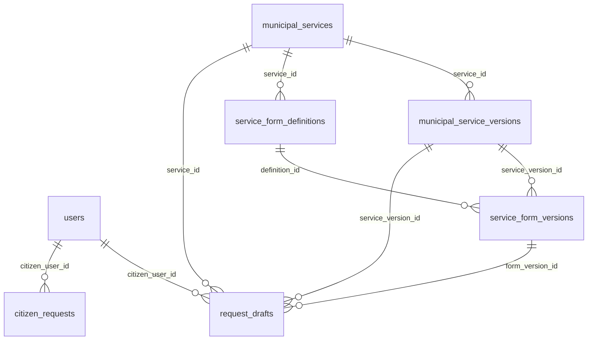
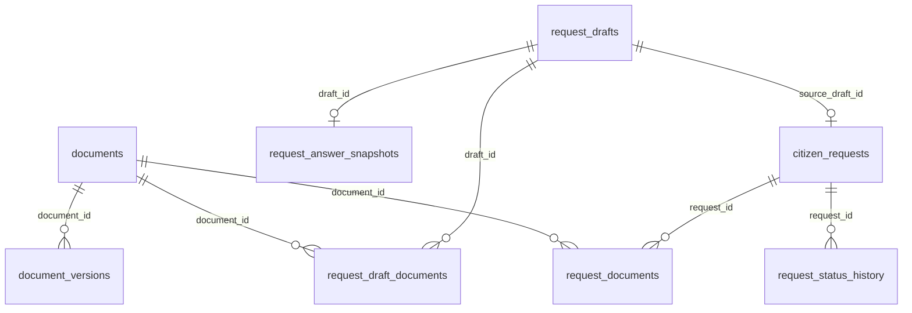
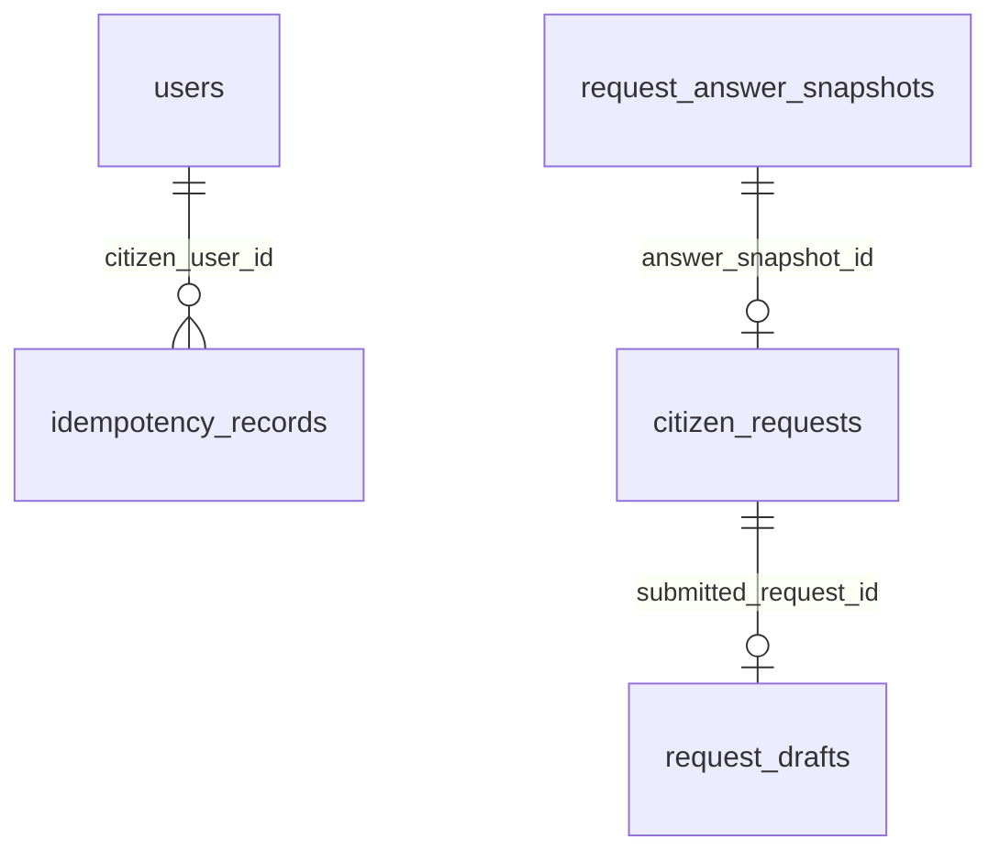

# CR-01 — ERD de pedidos fundamentado nas migrations

**Fonte:** V2 (`users`), V4 (`municipal_services`, `documents`, `citizen_requests`, `request_status_history`, `request_documents`), V9 (`municipal_service_versions`, `service_form_definitions`, `service_form_versions`), V10 (`request_drafts`), V11 (`document_versions`, `request_draft_documents`), V12 (`request_answer_snapshots`, `idempotency_records`, `domain_outbox_events`). Outbox associa agregado por tipo/UUID no payload, **sem FK SQL**; a seta lógica não deve ser confundida com FK.

| Tabela | Campos essenciais e invariantes |
| --- | --- |
| `municipal_service_versions` | `(service_id,version_number)` único; índice parcial permite só uma PUBLISHED por serviço; `online_submission_enabled`. |
| `service_form_versions` | `(definition_id,version_number)` único, um PUBLISHED por definição; `schema_json`, `eligibility_json`, `document_requirements_json`, `declaration_version/text`, checksum; FK para service version. |
| `request_drafts` | Dono, serviço e **IDs das versões fixadas**, respostas/eligibilidade JSONB, status, `current_step_key`, `version` usado por `@Version` e If-Match, `expires_at`, `submitted_request_id` opcional. Índice `(citizen_user_id,status,updated_at DESC)` suporta lista CR-01. |
| `request_draft_documents` | `(draft_id,requirement_key)` único quando `active=TRUE`; ligação a documento do proprietário confirmada pelo serviço, não apenas pela FK. |
| `documents`/`document_versions` | Dono, armazenamento e scanner; versão de ficheiro, sha256, MIME detetado, status. Validar `VALID` antes do link/submit. |
| `request_answer_snapshots` | Um por draft, copia answers/eligibility/document manifest/declaration/checksum; preserva prova da versão submetida. |
| `citizen_requests` | Pedido submetido, referência, estado, `source_draft_id` único quando preenchido, `answer_snapshot_id`; legado pode ter ambos null. |
| `request_status_history` | Eventos de estado por request/actor; lista temporal no detalhe citizen. |
| `idempotency_records` | `(citizen_user_id,operation,idempotency_key_hash)` único; fingerprint, estado e `response_resource_id` são gravados pela transação de submissão; sem FK declarada para response ID. |
| `domain_outbox_events` | `aggregate_type`, `aggregate_id`, payload/status/tentativas; sem FK ao pedido; dispatcher independente após commit. |

Não há migration CR-01: a lista de drafts e a regra de visibilidade usam campos/índices existentes. O [backend CI run #66](https://github.com/rightware-corporations/boane-conecta-fullstack-app/actions/runs/36007930140) executou `PostgresMigrationTest` em PostgreSQL 16 Testcontainers (1/1 PASS, 0 skipped), provando as migrations nesse ambiente de teste; o estado da base QA Windows continua por verificar.
