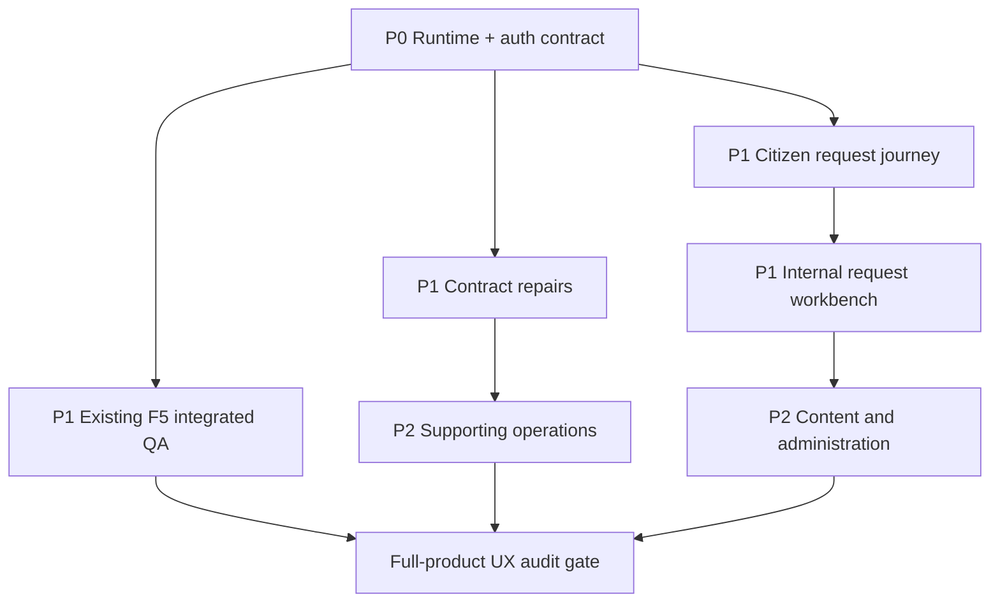

# BOANE CONECTA — FULL PRODUCT FUNCTIONAL COVERAGE AUDIT V1

## Block 10 — Frontend + Backend + Route + Contract Inventory

**Status:** AUDIT COMPLETE — IMPLEMENTATION AND REDESIGN DEFERRED  
**Date:** 2026-09-04  
**Repository:** `rightware-corporations/boane-conecta-fullstack-app`  
**Working path:** `/workspace/scratch/4da30144c903/usb-codebase/repo`  
**Branch:** `feat/fullstack-f5-appointments-queue`  
**Committed HEAD:** `88e4d852f374169e41b778d21a4076322f5062fb`  
**Remote F5 baseline:** `378fc31a7539fd086e1268e4c3a0c1c07c7f0cb0`  
**Functional frontend authority:** Reconstructed Worktree Baseline V2  
**Change policy:** report only; no feature implementation, redesign, migration, dependency change, commit or push

---

## 1. Executive decision

The repository is not a visually incomplete single product. It is a mixed-maturity system with three distinct realities:

1. **real integrated vertical slices** — public Services, citizen profile/dashboard/requests/documents, F5 appointments and queues, and read-only Admin Services;
2. **real backend domains without operational UI** — request drafts/submission, administrative requests, complaints, payments, documents, reports and notification administration;
3. **wired/static/speculative frontend surfaces without matching backend contracts** — content publishing, licences, public request lookup, contacts, public documents, notices, tenders, FAQ and gallery.

The correct next move is not a redesign. The product first needs a controlled integration foundation and then completion of the core citizen request journey. The recommended next implementation block is **Block 11 — Integrated Runtime and Contract Baseline**, bounded to making the existing stack reproducibly runnable, validating authentication/roles and freezing real API contracts. It must not add a new product domain.

### Highest-risk findings

- `/servicos/pedidos` simulates a lookup against hard-coded citizen/request data and never calls the imported service.
- `/reclamacoes` calls a real endpoint with an incompatible request body and expects an incompatible response shape.
- post-login defaults send Editor, Funcionário and Gestor to placeholder routes rather than the productive `/admin` landing.
- citizen Payments uses a speculative frontend DTO that does not match `PaymentResponse`; payment initiation calls a nonexistent `/payments/initiate` endpoint.
- Licences has a complete-looking client screen but no backend model, controller, service or migration.
- content tables exist, but News, Projects, Notices, Tenders, FAQ and Gallery have no backend controllers/services; frontend clients are speculative.
- public Documents is entirely static while the backend exposes only citizen/admin document surfaces.
- frontend authorization remains a presentation mirror with hard-coded permissions; backend roles remain definitive. CG-001 is still open outside the narrow Services decision.
- there is no full-stack E2E suite and most wired routes have no component or authorization tests.

---

## 2. Audit basis and method

The audit read and cross-checked:

- `frontend/src/App.tsx` and every wired route;
- every page under `frontend/src/pages`;
- Public, Citizen, Admin, Internal and Executive shell implementations;
- route guards, auth context, role normalization and presentation permissions;
- all frontend service/API modules and transport/presentation types;
- all Spring controllers, DTOs, service and persistence modules;
- all `@PreAuthorize` declarations and security configuration;
- Flyway migrations V1–V19;
- frontend and backend test inventories;
- Docker/application configuration and environment templates;
- Blocks 01–09 records, F0–F5 implementation reports, relevant ADRs and canonical product, UX, governance, backend and mobile authorities.

Classification is based on executable code. A route, service filename, table or design specification by itself was not treated as proof of a functional feature.

### Classification vocabulary

Frontend status uses exactly: `COMPLETE_FUNCTIONAL`, `PARTIAL_FUNCTIONAL`, `PLACEHOLDER`, `STATIC_ONLY`, `DEAD_ROUTE`, `MISSING_UI`, `SPECULATIVE_CLIENT`, `BLOCKED_BY_CONTRACT`, `BLOCKED_BY_AUTH`, `BLOCKED_BY_BACKEND`, `NOT_IN_SCOPE`.

Backend status uses exactly: `REAL_COMPLETE`, `REAL_PARTIAL`, `CONTROLLER_ONLY`, `SERVICE_ONLY`, `MODEL_ONLY`, `NO_BACKEND`, `SPECULATIVE`, `BLOCKED`, `NOT_REQUIRED`.

Test status is summarized as `COVERED`, `PARTIAL`, `NONE` or `NOT_APPLICABLE` across unit, component, API-contract, authorization, integration and E2E levels.

---

## 3. Complete wired-route inventory and screen completeness matrix

Every route currently wired by `App.tsx` appears below. `API` describes the actual client call, not a desired future path.

| ID | Surface | Route | Screen / actor / purpose | Frontend | Backend | API / Auth / DB | Tests | Blocker | Priority | Proposed block |
|---|---|---|---|---|---|---|---|---|---|---|
| PUB-01 | Public | `/` | Home; anonymous; orient and discover tasks | PARTIAL_FUNCTIONAL | REAL_PARTIAL | GET `/public/services`; public; services V4 | PARTIAL | most sections are static/config-derived; only services are live | P1 | 15 |
| PUB-02 | Public | `/sobre` | Institutional overview; anonymous | STATIC_ONLY | NOT_REQUIRED | none; public; no required persistence | NONE | municipal facts/images require content governance | P3 | 18 |
| PUB-03 | Public | `/servicos` | Service catalogue; anonymous | COMPLETE_FUNCTIONAL | REAL_COMPLETE | GET `/public/services`; public; V3/V4 | COVERED | integrated runtime/real data QA | P1 | 11 |
| PUB-04 | Public | `/servicos/:slug` | Service detail; anonymous | COMPLETE_FUNCTIONAL | REAL_COMPLETE | GET `/public/services/{slug}`; public; V3/V4 | COVERED | no citizen request-start handoff | P1 | 12 |
| PUB-05 | Public | `/contactos` | Contact information and message form; anonymous | SPECULATIVE_CLIENT | NO_BACKEND | POST `/contact/messages`; public; no table | NONE | endpoint, DTO, persistence/dispatch policy absent | P2 | 17 |
| PUB-06 | Public | `/noticias` | Published news list; anonymous | SPECULATIVE_CLIENT | MODEL_ONLY | GET `/news`; public; `news` V6 | NONE | route/controller/service/DTO absent; frontend DTO diverges | P2 | 16 |
| PUB-07 | Public | `/noticias/:id` | News detail; anonymous | SPECULATIVE_CLIENT | MODEL_ONLY | GET `/public/news/{id}`; public; `news` V6 | NONE | path disagrees with list client; backend absent | P2 | 16 |
| PUB-08 | Public | `/reclamacoes` | Submit complaint/suggestion; anonymous | BLOCKED_BY_CONTRACT | REAL_COMPLETE | POST `/public/complaints`; public; complaints V5 | PARTIAL | body expects `subject,description,priority`; UI sends identity/category/location; response expects `reference` but backend returns `complaintNumber` | P1 | 13 |
| PUB-09 | Public | `/faq` | Frequently asked questions; anonymous | STATIC_ONLY | MODEL_ONLY | none; public; `faqs` V6 | NONE | hard-coded questions; no controller | P3 | 16 |
| PUB-10 | Public | `/pelouros` | Departments/officeholders; anonymous | STATIC_ONLY | REAL_COMPLETE | no client call; public departments API exists; departments V3 | NONE | screen does not use real department API; officeholder data has no model | P2 | 15 |
| PUB-11 | Public | `/distritos` | District/locality information; anonymous | STATIC_ONLY | REAL_COMPLETE | no client call; public districts API exists; districts V3 | NONE | screen is hard-coded and does not use API | P2 | 15 |
| PUB-12 | Public | `/plano-desenvolvimento` | Development plan; anonymous | STATIC_ONLY | NO_BACKEND | none; public; no plan/document relation | NONE | static claims/download actions lack governed source | P3 | 18 |
| PUB-13 | Public | `/projetos` | Municipal projects; anonymous | SPECULATIVE_CLIENT | MODEL_ONLY | GET `/public/projects`; public; projects V6 | NONE | no controller/service/DTO; errors collapse to empty | P2 | 16 |
| PUB-14 | Public | `/tributos` | Tax/tribute guidance; anonymous | STATIC_ONLY | NO_BACKEND | none; public | NONE | static guidance/download/payment links lack contract | P2 | 17 |
| PUB-15 | Public | `/galeria` | Municipal gallery; anonymous | STATIC_ONLY | MODEL_ONLY | none; public; gallery_items V6 | NONE | hard-coded media; backend content surface absent | P3 | 16 |
| PUB-16 | Public | `/concursos` | Tenders/competitions; anonymous | STATIC_ONLY | MODEL_ONLY | no client call; public; tenders V6 | NONE | hard-coded records; speculative `/tenders` client unused; no controller | P2 | 16 |
| PUB-17 | Public | `/doacoes` | Donation projects/contribution modal; anonymous | STATIC_ONLY | NO_BACKEND | none; public | NONE | fake progress/projects and no payment/donation domain | P4 | 19 |
| PUB-18 | Public | `/servicos/pedidos` | Public request lookup; anonymous | SPECULATIVE_CLIENT | NO_BACKEND | **no actual call**; imported speculative POST `/service-requests/lookup`; hard-coded mock data | NONE | privacy-safe lookup contract absent; misleading simulation | P0 | 12 |
| PUB-19 | Public | `/documentos` | Public document library; anonymous | STATIC_ONLY | REAL_PARTIAL | no client call; admin/citizen document APIs only; documents V4/V11 | NONE | public visibility/list/download contract absent; hard-coded documents | P2 | 17 |
| PUB-20 | Public | `/avisos` | Notices/announcements; anonymous | SPECULATIVE_CLIENT | MODEL_ONLY | GET `/announcements`; public; notices V6 | NONE | no backend route; UI falls back to fabricated announcements | P2 | 16 |
| PUB-21 | Public | `/filas/:queueId/display` | Public queue display; anonymous | COMPLETE_FUNCTIONAL | REAL_COMPLETE | GET `/public/queues/{queueId}/display`; public; queues/tickets V14–V19 | COVERED | integrated display/device QA | P1 | 11 |
| AUTH-01 | Auth | `/auth` | Login and citizen registration; anonymous-only | PARTIAL_FUNCTIONAL | REAL_COMPLETE | POST `/auth/login`, `/register`, `/refresh`, `/logout`; GET `/auth/me`; V2/V8 | PARTIAL | demo credentials shown in UI; password min differs; no recovery; redirect defaults target placeholders | P0 | 11 |
| INT-01 | Internal | `/admin` | Role-aware internal landing; internal staff | COMPLETE_FUNCTIONAL | NOT_REQUIRED | ProtectedRoute + roles SA/Admin/Editor/Employee/Manager; no API | COVERED | full authoritative RBAC matrix remains open | P0 | 11 |
| INT-02 | Content | `/admin/noticias` | News administration; SA/Admin/Editor | PLACEHOLDER | MODEL_ONLY | guard exists; no call; news V6 | NONE | backend publishing module absent | P2 | 16 |
| INT-03 | Content | `/admin/servicos` | Read service catalogue; SA/Admin/Manager | COMPLETE_FUNCTIONAL | REAL_COMPLETE | GET `/admin/services`; exact read-role alignment; V3/V4 | COVERED | mutations intentionally absent; visual integrated QA | P1 | 11 |
| INT-04 | Content | `/admin/projectos` | Project administration; SA/Admin/Manager | PLACEHOLDER | MODEL_ONLY | guard exists; no call; projects V6 | NONE | backend module absent; Manager capability unproven beyond frontend | P2 | 16 |
| INT-05 | Admin | `/admin/utilizadores` | User administration; SA/Admin | PLACEHOLDER | REAL_PARTIAL | guard exists; speculative `/admin/users` client; auth/user repositories exist V2 | NONE | no admin user controller/service/DTO or invitation contract | P2 | 17 |
| INT-06 | Operations | `/admin/pedidos` | Process citizen requests; SA/Admin/Employee | PLACEHOLDER | REAL_COMPLETE | guard exists; page makes no call; backend `/admin/requests`; V4/V9–V12 | PARTIAL | UI not integrated; frontend legacy client uses wrong `/admin/service-requests` paths/DTO | P1 | 14 |
| INT-07 | Operations | `/admin/filas` | Operate desks/tickets/sessions; SA/Admin/Employee/Manager | COMPLETE_FUNCTIONAL | REAL_COMPLETE | GET snapshots; POST operational commands; scoped backend; V14–V19 | COVERED | integrated concurrency/role QA | P1 | 11 |
| INT-08 | Operations | `/admin/agenda` | Scoped appointments/check-in; SA/Admin/Employee/Manager | COMPLETE_FUNCTIONAL | REAL_COMPLETE | GET `/admin/appointments`; POST check-in; scoped backend; V5/V14–V16 | PARTIAL | no page-level test; integrated runtime QA | P1 | 11 |
| INT-09 | Admin | `/admin/filas/configuracao` | Queue/rules/operator configuration; SA/Admin | COMPLETE_FUNCTIONAL | REAL_COMPLETE | queue CRUD/scopes + schedule-rule endpoints; V14–V19 | PARTIAL | page behavior lacks component tests; DTO validation needs runtime | P1 | 11 |
| CIT-01 | Citizen | `/municipe` | Citizen dashboard; Citizen (+ SA/Admin frontend override) | COMPLETE_FUNCTIONAL | REAL_COMPLETE | GET `/citizen/dashboard`; backend CITIZEN only; V2–V15 | NONE | **authorization mismatch:** frontend permits SA/Admin, backend requires CITIZEN; no component/contract test | P0 | 11 |
| CIT-02 | Citizen | `/municipe/perfil` | View/update profile; Citizen (+ SA/Admin frontend override) | COMPLETE_FUNCTIONAL | REAL_COMPLETE | GET/PATCH `/citizen/me`; backend CITIZEN only; V3 | PARTIAL | authorization mismatch; no frontend test | P0 | 11 |
| CIT-03 | Citizen | `/municipe/pedidos` | List/filter requests; Citizen (+ SA/Admin frontend override) | COMPLETE_FUNCTIONAL | REAL_COMPLETE | GET `/citizen/requests`; backend CITIZEN only; V4/V9–V12 | PARTIAL | authorization mismatch; no component/API client tests | P0 | 11 |
| CIT-04 | Citizen | `/municipe/pedidos/:id` | Request status/timeline/documents; Citizen (+ SA/Admin override) | PARTIAL_FUNCTIONAL | REAL_COMPLETE | GET `/citizen/requests/{id}`; backend owner-scoped; V4/V11 | PARTIAL | frontend document summary expects `documentType`, backend returns `fileName`; authorization mismatch | P0 | 11 |
| CIT-05 | Citizen | `/municipe/documentos` | Upload/list/download documents; Citizen (+ SA/Admin override) | COMPLETE_FUNCTIONAL | REAL_COMPLETE | GET/POST/download `/citizen/documents`; backend CITIZEN only; V4/V11 | PARTIAL | authorization mismatch; frontend lacks archive/attach lifecycle; no tests | P1 | 12 |
| CIT-06 | Citizen | `/municipe/licencas` | Licence list/download/renewal; Citizen (+ SA/Admin override) | SPECULATIVE_CLIENT | NO_BACKEND | GET `/citizen/licenses`; no model/table/controller | NONE | entire licence domain absent | P3 | 19 |
| CIT-07 | Citizen | `/municipe/pagamentos` | Payment list/status/receipt; Citizen (+ SA/Admin override) | BLOCKED_BY_CONTRACT | REAL_COMPLETE | GET `/citizen/payments`; backend CITIZEN ownership; payments V5 | PARTIAL | frontend `Payment` snake_case/type fields do not match `PaymentResponse`; initiation path nonexistent; authorization mismatch | P1 | 13 |
| CIT-08 | Citizen | `/municipe/agendamentos` | Book/hold/confirm/reschedule/cancel/check-in/ticket; Citizen (+ SA/Admin override) | COMPLETE_FUNCTIONAL | REAL_COMPLETE | citizen appointment/hold/queue-ticket APIs; CITIZEN; V5/V14–V19 | COVERED | frontend guard mismatch for SA/Admin; real QR/camera and time-window QA | P1 | 11 |
| CIT-09 | Citizen | `/municipe/notificacoes` | List and mark notifications read; Citizen (+ SA/Admin override) | COMPLETE_FUNCTIONAL | REAL_COMPLETE | GET/PATCH citizen notifications; owner-scoped; V6/V13 | PARTIAL | authorization mismatch; no frontend tests | P1 | 11 |
| SYS-01 | System | `*` | Not-found route | COMPLETE_FUNCTIONAL | NOT_REQUIRED | none | NONE | route-level behavior not tested | P3 | 18 |

### Route-count reconciliation

- Public routes: 21
- Auth routes: 1
- Internal/Admin routes: 9
- Citizen routes: 9
- Catch-all: 1
- **Total wired route patterns: 41**

No executive route is wired. `ExecutiveShell.tsx` exists but is not reachable. `AdminShell.tsx` also exists as an unwired shell; current internal compatibility is `AdminLayout` with selective `InternalShell` opt-in.

---

## 4. Surface-family assessment

### 4.1 Public

Public Services and the queue display are the only end-to-end public data surfaces with aligned contracts and focused tests. Home is a service-first scaffold with a live services slice and static supporting sections. Most institutional/content pages are static, speculative clients or use fabricated fallbacks.

The most urgent public defect is not visual: public request lookup presents realistic mock personal/request data. It must be removed or replaced by an approved privacy-safe lookup contract before public release.

### 4.2 Authentication

Backend authentication is real: registration, login, refresh rotation, logout, current-user and change-password endpoints exist with JWT security and persisted hashed refresh tokens. Frontend login/registration and bootstrap are functional.

Gaps:

- no password-recovery/reset route or backend workflow;
- access and refresh tokens are kept in localStorage, increasing XSS consequence;
- the API client has no centralized 401 refresh/retry path;
- logout ignores server failure but clears session only after the call returns;
- `/auth` advertises hard-coded demo credentials not created by migrations;
- frontend minimum password length is six while backend validation is authoritative and may differ;
- post-login route defaults send Editor to placeholder News, Funcionário to placeholder Requests and Gestor to placeholder Projects;
- forbidden behavior renders inline text instead of a governed forbidden route/state.

### 4.3 Citizen portal

Dashboard, profile, requests, request detail, documents, notifications and the F5 appointment journey have real backend support. Payments has a real backend but a mismatched legacy client contract. Licences is speculative.

There is no UI for the approved request creation journey even though the backend already supports:

- published request definition;
- create/resume draft;
- eligibility;
- autosaved answers with versioning;
- document attachment;
- validation;
- idempotent submission and outbox.

This missing UI is the largest core-journey product gap after runtime/auth alignment.

### 4.4 Internal/Admin

Internal landing, Filas, Agenda, queue configuration and read-only Services are real. Requests, News, Projects and Users are placeholders. Administrative backend exists for Requests but the frontend still exposes a legacy speculative `service-requests` client instead of `/admin/requests`.

### 4.5 Executive/Management

`ExecutiveShell.tsx` exists but no route or data consumer uses it. Reports backend endpoints exist for dashboard, requests, payments, complaints and appointments, but there is no executive screen. This is `MISSING_UI` against `REAL_COMPLETE` backend support and remains P3 until P0/P1 journeys are complete.

---

## 5. API contract matrix

All backend responses use the shared `ApiResponse<T>` success envelope. Collection endpoints generally return plain lists inside that envelope; current backend controllers do not implement the pagination envelopes assumed by several legacy frontend services.

| Domain | Frontend method/path | Backend method/path | DTO/envelope | Finding |
|---|---|---|---|---|
| Auth | POST `/auth/register` | same | RegisterRequest → CurrentUserResponse | aligned; citizen role assigned by backend |
| Auth | POST `/auth/login` | same | LoginRequest → AuthResponse | aligned through explicit frontend adapter |
| Auth | POST `/auth/refresh`, `/logout`; GET `/auth/me` | same | refresh token / CurrentUserResponse | aligned; no automatic retry |
| Services public | GET `/public/services`, `/{slug}` | same | MunicipalServiceResponse in ApiResponse | aligned through explicit adapter; covered |
| Services admin read | GET `/admin/services` | same | MunicipalServiceResponse[] | aligned; read roles aligned |
| Services admin mutations | legacy POST/PATCH/DELETE `/admin/services` | backend POST/PUT/DELETE | legacy `Service` vs MunicipalServiceRequest/Response | DTO_MISMATCH and method mismatch on update; client unused by current screen |
| Departments | GET `/admin/departments` | same | DepartmentResponse[] | aligned for queue configuration |
| Districts public/admin | no active client | GET public; CRUD admin | DistrictResponse | BACKEND_WITHOUT_FRONTEND |
| Home | GET `/public/services` | same | reduced service adapter | aligned; other home modules are not API-backed |
| News | GET `/news`, GET `/public/news/{id}`, CRUD `/admin/news` | none | legacy NewsArticle | FRONTEND_API_WITHOUT_BACKEND; inconsistent list/detail prefixes |
| Projects | GET `/public/projects`; speculative `/projects`; CRUD `/admin/projects` | none | legacy/project-local DTO | FRONTEND_API_WITHOUT_BACKEND; MODEL_ONLY persistence |
| Notices | GET `/announcements` | none | legacy Announcement | FRONTEND_API_WITHOUT_BACKEND; table is named `notices` |
| Tenders | GET `/tenders` | none | legacy Tender | FRONTEND_API_WITHOUT_BACKEND |
| Public documents | GET `/documents/public` | none | legacy Document | FRONTEND_API_WITHOUT_BACKEND; citizen/admin document APIs use different DTO |
| Gallery | GET `/gallery` | none | GalleryItem | FRONTEND_API_WITHOUT_BACKEND; current page does not call it |
| FAQ | GET `/faqs` | none | Faq | FRONTEND_API_WITHOUT_BACKEND; current page static |
| Contact | POST `/contact/messages` | none | ContactMessage | FRONTEND_API_WITHOUT_BACKEND; persistence/dispatch not approved |
| Public complaint | POST `/public/complaints` | same | frontend Complaint vs CreateComplaintRequest | DTO_MISMATCH; response `complaintNumber` vs expected `reference` |
| Public request lookup | imported POST `/service-requests/lookup`, not invoked | none | legacy ServiceRequest | speculative and privacy contract absent |
| Citizen profile | GET/PATCH `/citizen/me` | same | CitizenProfileResponse / UpdateCitizenProfileRequest | aligned; frontend guard broader than backend |
| Citizen dashboard | GET `/citizen/dashboard` | same | CitizenDashboardResponse | substantially aligned; frontend guard broader |
| Citizen request list/detail | GET `/citizen/requests`, `/{id}` | same | CitizenRequestResponse / DetailResponse | list aligned; detail document field mismatch |
| Citizen request create | no screen/client for dynamic journey | definition/draft/validate/submit APIs exist | versioned definition + draft DTOs | BACKEND_WITHOUT_FRONTEND |
| Citizen documents | GET/POST/download `/citizen/documents` | same | multipart + DocumentResponse | aligned; archive/attach API unused |
| Citizen notifications | GET and PATCH read/read-all | same | CitizenNotificationResponse | aligned |
| Citizen payments list | GET `/citizen/payments` | same | legacy Payment vs PaymentResponse | DTO_MISMATCH |
| Payment initiation | POST `/payments/initiate` | none; backend uses POST `/citizen/payments` | incompatible request/response | ROUTE_MISMATCH and DTO_MISMATCH |
| Citizen licences | GET `/citizen/licenses` | none | legacy License | FRONTEND_API_WITHOUT_BACKEND |
| Citizen appointments | list/get/availability/hold/confirm/cancel/reschedule/check-in | same | explicit F5 DTOs | aligned and covered |
| Citizen queue ticket | GET `/citizen/queue-tickets/{id}` | same | CitizenQueueTicketResponse | aligned and covered |
| Admin appointments | list + assisted check-in | same | AppointmentResponse / CheckInResponse | aligned; scope enforced backend |
| Queue configuration | GET/POST queues, status, desks, staff scopes | same | QueueAdminResponse family | aligned; If-Match used where required |
| Queue operations | snapshots and operational commands | same | snapshot/operation DTOs | aligned; call-next idempotency key used |
| Public queue display | GET `/public/queues/{id}/display` | same | PublicQueueDisplayItem[] | aligned and covered |
| Admin requests | legacy `/admin/service-requests` | backend `/admin/requests` | legacy paginated AdminServiceRequest vs list CitizenRequestResponse | ROUTE_MISMATCH, DTO_MISMATCH, pagination mismatch |
| Admin users | `/admin/users` client | none | legacy AdminUser | FRONTEND_API_WITHOUT_BACKEND |
| Admin complaints | no UI/client | `/admin/complaints` | ComplaintResponse | BACKEND_WITHOUT_FRONTEND |
| Admin documents | no UI/client | `/admin/documents` | DocumentResponse | BACKEND_WITHOUT_FRONTEND |
| Admin payments | no UI/client | `/admin/payments` | PaymentResponse | BACKEND_WITHOUT_FRONTEND |
| Admin notifications | no UI/client | `/admin/notifications` | NotificationResponse | BACKEND_WITHOUT_FRONTEND; controller lacks explicit method security annotation |
| Reports | stale GET `/admin/dashboard` client | backend `/admin/reports/*-summary` | DashboardMetrics vs summary DTOs | ROUTE_MISMATCH; current landing correctly avoids fake metrics |

### Error, pagination, filtering and idempotency findings

- Error handling is not represented by a versioned frontend error DTO; `ApiError` accepts only an optional `message`, while backend validation/security errors may carry additional structure.
- Legacy services assume `PaginatedResponse` for News, Projects, Services, Requests and Users. Current backend list controllers return `ApiResponse<List<...>>` and mostly support enum filters, not the frontend page/limit/search schema.
- Public Projects catches all errors and returns an empty list, making failure indistinguishable from true emptiness.
- Avisos uses fallback fabricated content after backend failure.
- F5 correctly applies idempotency to hold, confirm, cancel, reschedule, check-in and call-next paths where specified. Some queue commands do not require a client key because backend invariants/locking govern them.
- request submission backend has persisted idempotency records and outbox delivery, but no frontend uses that contract.

---

## 6. Authorization matrix

### 6.1 Actual role normalization

| Backend authority | Frontend role |
|---|---|
| `SUPER_ADMIN` | `super_admin` |
| `ADMIN` | `admin` |
| `MANAGER` | `gestor` |
| `EMPLOYEE` | `funcionario` |
| `EDITOR` | `editor` |
| `CITIZEN` | `municipe` |

Normalization is performed in `auth.service.ts`. Frontend `permissionsByRole` is presentation metadata, not backend authorization.

### 6.2 Protected route/action facts

| Resource / route family | Read | Create | Update | Delete/archive | Special actions / scope |
|---|---|---|---|---|---|
| `/admin` | SA, Admin, Editor, Employee, Manager frontend | N/A | N/A | N/A | presentation landing only |
| Admin Services | SA, Admin, Manager | SA, Admin backend; no UI | SA, Admin backend; no UI | SA delete; no UI | requirements/fees read includes Manager; manage excludes Manager |
| Admin Filas/Agenda | SA, Admin, Employee, Manager | operational commands depend on staff scope | same | N/A | queue scope/desk ownership enforced in service layer |
| Queue configuration | SA, Admin | SA, Admin | SA, Admin | revoke staff SA/Admin | route and controller align |
| Admin Requests | SA, Admin, Employee, Manager backend read | citizen creates | Employee may status-update; assign excludes Employee | no delete | resource/organizational scope needs matrix confirmation |
| Admin Complaints | SA, Admin, Employee, Manager read | public/citizen create | status includes Employee; assignment excludes Employee | none | no frontend route |
| Admin Documents | SA, Admin, Employee, Manager read | citizen upload | status excludes Employee | archive handled citizen owner path | no frontend route |
| Admin Payments | SA, Admin, Employee, Manager read | citizen create | status excludes Employee | none | no frontend route |
| Admin News | frontend SA/Admin/Editor | absent backend | absent | absent | route guard is only aspirational until content module exists |
| Admin Projects | frontend SA/Admin/Manager | absent backend | absent | absent | do not generalize Services access |
| Admin Users | frontend SA/Admin | absent backend | absent | absent | repositories are not an admin contract |
| Citizen routes | frontend Citizen + SA/Admin | backend CITIZEN only | backend CITIZEN owner | backend CITIZEN owner where available | **AUTHORIZATION_MISMATCH** for SA/Admin frontend override across all citizen routes |
| Public complaint | anonymous | anonymous | none | none | accepted without citizen identity; privacy/rate-limit review needed |
| Public queue display | anonymous read | none | none | none | output is projection-only |

### 6.3 CG-001 findings

CG-001 remains open. Services has an evidence-backed narrow read decision; it cannot be copied to Requests, Projects, Payments or other domains. Current frontend hard-coded capabilities lack resource, scope and context semantics. Backend annotations also vary: some citizen/admin controllers rely on global security plus principal ownership rather than class-level annotations. Before new protected UI is connected, each domain needs a small capability table covering:

`ROLE + CAPABILITY + RESOURCE + SCOPE + CONTEXT`.

No frontend route should be widened merely to support testing. Test accounts should carry the actual backend role required by the endpoint.

---

## 7. Database and migration support

| Domain | Entities/tables | Migration | Key relations/indexes/lifecycle | Support verdict |
|---|---|---|---|---|
| Auth/RBAC | users, roles, permissions, user_roles, role_permissions, refresh_tokens, audit_logs | V2, V8 | unique email; token user/expiry indexes; status enums in code | REAL_COMPLETE |
| Institutional | districts, departments, citizen_profiles | V3 | profile→user/district; public/admin controllers | REAL_COMPLETE |
| Services | municipal_services, requirements, fees | V4 | department FK; cascade child records; DRAFT/PUBLISHED/ARCHIVED | REAL_COMPLETE |
| Versioned forms | municipal_service_versions, form definitions/versions | V9 | version/status indexes and immutable published definitions | REAL_COMPLETE |
| Request drafts | request_drafts, request_draft_documents | V10/V11 | citizen/service/form versions; expiry and status indexes | REAL_COMPLETE |
| Submission | answer snapshots, idempotency_records, domain_outbox_events | V12 | unique draft snapshot; expiry/dispatch indexes; atomic link to request | REAL_COMPLETE |
| Requests | citizen_requests, history, request_documents | V4/V12 | citizen/service/assignee; lifecycle history; source draft | REAL_COMPLETE |
| Documents | documents, document_versions | V4/V11 | owner, object-storage metadata, SHA, scan status; owner/scan indexes | REAL_COMPLETE |
| Complaints | complaints, complaint_status_history | V5 | optional citizen/assignee; lifecycle in code | REAL_COMPLETE |
| Payments | payments, payment_receipts | V5 | user/request/document FKs; status enum | REAL_COMPLETE |
| Appointments | slots, appointments, rules, holds | V5/V14–V16 | capacity, optimistic version, holds, credential audit, time indexes | REAL_COMPLETE |
| Queues | queues, desks, tickets, sessions, counters, events, staff scopes | V14–V19 | strong FKs, sequence uniqueness, lifecycle/events/scopes | REAL_COMPLETE |
| Notifications | notifications | V6/V13 | user/read/created and expiry indexes; context fields | REAL_COMPLETE |
| Content | news, notices, projects, tenders, gallery_items, faqs | V6 | basic FKs/status columns; no repositories/controllers/services | MODEL_ONLY |
| Licences | none | none | none | NO_BACKEND |
| Contact messages | none | none | none | NO_BACKEND |
| Donations | none | none | none | NO_BACKEND |
| Tax/tribute content | none | none | none | NO_BACKEND |
| Public request lookup | request persistence exists; no lookup credential/token model | none specific | NUIT/reference-only design would require privacy/rate-limit decision | BLOCKED |

Audit-log storage exists, but systematic domain audit emission is not proven across all mutations. Municipal/tenant scoping is not represented as a universal tenant key; this repository currently models a single municipality and uses department/queue/user ownership scopes where implemented.

---

## 8. Real business journeys

### 8.1 Citizen request

**Backend-supported sequence:** published service definition → authenticated citizen → create/resume draft → eligibility → autosaved/versioned answers → attach scanned documents → validate → idempotent submit → request + snapshot + outbox → citizen list/detail/timeline.

**Frontend reality:** catalogue/detail and post-submission list/detail exist. The entire authenticated form/draft/submission middle is missing. The public lookup is unrelated mock logic and must not substitute for authenticated tracking.

**Status:** `BLOCKED_BY_FRONTEND`, P1 after runtime/auth foundation.

### 8.2 Appointment

Service → location/date availability → slot → temporary hold → confirm → one-time check-in credential → cancel/reschedule → QR/manual check-in → queue ticket → live ticket projection.

The frontend and backend implement this sequence, including expiry, version headers and idempotency. Remaining work is integrated runtime, role, camera/device, time-window and concurrency QA.

**Status:** functional vertical slice; P1 validation.

### 8.3 Queue

Admin configures queue/desks/staff/schedule rules → authorized operator opens owned desk → calls next → recall/start service → complete/no-show/transfer → public/citizen projections.

Backend invariants, staff scopes, events and sequence allocation are present. UI exists for configuration and operation. Remaining work is integrated multi-actor QA and component coverage for configuration/agenda.

**Status:** functional vertical slice; P1 validation.

### 8.4 Content

Tables model author/status/published timestamps, but no executable authoring/review/publish service exists. Frontend admin News/Projects pages correctly remain placeholders. Public pages are static/speculative.

No review workflow is approved or implemented. Do not infer one from `DRAFT`/`PUBLISHED` columns.

**Status:** MODEL_ONLY; future bounded content-domain design required.

### 8.5 Complaints

Backend supports anonymous/citizen creation, citizen ownership views, admin list/assign/status and history. Public form contract is incompatible and there are no citizen/admin screens.

**Status:** backend-real, frontend-partial; P1 contract repair followed by P2 portal/admin surfaces.

### 8.6 Payments

Backend supports citizen creation/list/detail and admin list/detail/status, persisted receipts. Frontend list DTO and initiation route are incompatible; no external payment-provider orchestration is implemented.

**Status:** real municipal payment-record domain, not yet an online payment integration.

---

## 9. Test coverage matrix

| Feature family | Unit | Component | API contract | Authorization | Integration | E2E |
|---|---|---|---|---|---|---|
| Public Home | COVERED | COVERED | COVERED (services) | NOT_APPLICABLE | NONE | NONE |
| Public Services | COVERED | COVERED | COVERED | NOT_APPLICABLE | backend BusinessModules PARTIAL | NONE |
| Public content/static pages | NONE | NONE | NONE | NOT_APPLICABLE | NONE | NONE |
| Public complaints | NONE | NONE | NONE frontend | NOT_APPLICABLE | COVERED backend | NONE |
| Public queue display | NONE | COVERED indirectly | COVERED | NOT_APPLICABLE | COVERED backend | NONE |
| Auth | NONE frontend | NONE | NONE frontend | NONE frontend | COVERED backend | NONE |
| Citizen dashboard/profile | NONE | NONE | NONE frontend | NONE frontend | COVERED backend | NONE |
| Citizen requests/detail | NONE | NONE | NONE frontend | NONE frontend | COVERED backend | NONE |
| Request drafts/submission | backend unit PARTIAL | MISSING_UI | NONE frontend | backend COVERED | COVERED backend | NONE |
| Citizen documents | NONE frontend | NONE | NONE frontend | NONE frontend | COVERED backend | NONE |
| Citizen payments | NONE frontend | NONE | NONE frontend | NONE frontend | COVERED backend | NONE |
| Citizen notifications | NONE frontend | NONE | NONE frontend | NONE frontend | COVERED backend | NONE |
| Citizen appointments | backend COVERED | QR component COVERED | COVERED | backend PARTIAL | COVERED backend | NONE |
| Queue configuration | backend COVERED | NONE | COVERED client | backend PARTIAL | COVERED incl. PostgreSQL concurrency | NONE |
| Queue operations | backend COVERED | NONE | COVERED client | backend PARTIAL | COVERED | NONE |
| Internal shell/landing | NOT_APPLICABLE | COVERED | NOT_APPLICABLE | COVERED presentation | NONE | NONE |
| Admin Services | adapter COVERED | COVERED | COVERED | COVERED | backend BusinessModules PARTIAL | NONE |
| Admin Requests | backend COVERED | NONE | NONE aligned | backend COVERED | COVERED backend | NONE |
| Admin content/users | NONE | NONE | NONE | route-only | NONE | NONE |
| Reports | backend unit through service integration PARTIAL | MISSING_UI | NONE | backend annotation | COVERED backend | NONE |

Current frontend result is 23 files / 76 tests, but route coverage is sparse. There is no browser E2E suite and no integrated role-journey harness.

---

## 10. Placeholders, dead code and speculative clients

### Explicit wired placeholders

- `AdminNoticias`
- `AdminProjectos`
- `AdminPedidos`
- `AdminUtilizadores`

### Static screens presenting domain-like content

- Sobre, Distritos, Pelouros, Plano de Desenvolvimento, Tributos, Galeria, Concursos, Doações, Documentos and FAQ.

These are not necessarily defects as prototypes, but they must not be presented as governed live municipal records without a content source.

### Speculative or stale clients

- `news.service.ts`
- `projects.service.ts`
- most of `public.service.ts`
- `requests.service.ts`
- `services.service.ts` admin mutations
- `users.service.ts`
- `dashboard.service.ts`
- citizen licences and payment initiation methods.

### Unwired architecture

- `AdminShell.tsx`
- `ExecutiveShell.tsx`
- report-summary backend endpoints have no UI.

No wired route is technically dead. The catch is semantic: several reachable routes are placeholders or disconnected from their available backend.

---

## 11. Frontend gap plan

| Gap | Preserve | Required real dependency | Missing behavior | Required tests |
|---|---|---|---|---|
| Runtime/auth alignment | existing AuthProvider, guards, shells | auth endpoints and real seed/bootstrap | safe test accounts, correct redirects, forbidden state, 401 policy | auth client, redirects, role matrix, integration smoke |
| Public lookup mock | page form/accessibility only | approved privacy-safe lookup endpoint, or remove route | real error/empty/result; rate-limit feedback | contract, privacy cases, enumeration resistance |
| Citizen request creation | service catalogue and CitizenShell | definition/draft/document/validate/submit APIs | guided steps, autosave/version conflict, offline/stale, validation, idempotent submit | adapter, component, auth, integration, E2E |
| Admin Requests | InternalShell/state primitives | `/admin/requests` real DTOs | filters, list, detail, assign/status actions by role | contract, capability, states, integration |
| Complaints | public form layout | CreateComplaintRequest/Response | aligned fields, real reference, citizen/admin lists | contract + all role/mutation paths |
| Payments | citizen layout | PaymentResponse + `/citizen/payments` | adapter, list/detail/status, no fake provider actions | contract, component, authorization |
| Documents | existing citizen upload/list | DocumentResponse/download/archive/attach | safe downloads, scan states, request attachment | MIME/size/error/security states |
| Public institutional data | existing route composition | districts/departments APIs and approved content source | real loading/empty/error; no invented officials | adapters/components/contracts |
| Content | placeholders and public route paths | approved content controllers/DTOs/workflow | authoring, publish controls, public projections | lifecycle, role, contract, integration |
| Users | placeholder | admin user management contract | list/detail/status/roles/invite only if approved | authorization/security/integration |

Responsive behavior must be validated per existing wireframe contracts when each route becomes real. This block does not authorize visual restructuring.

---

## 12. Backend gap plan

| Capability | Required module/endpoints | DTO/security/persistence | Special requirements | Dependencies |
|---|---|---|---|---|
| Integrated runtime contract | no new domain | document actual profiles, seeds and health | stable local bootstrap and error contract | PostgreSQL, MinIO, ClamAV, JWT |
| Public request lookup | dedicated projection endpoint only if approved | minimal response; opaque lookup credential; no NUIT-only enumeration | rate limiting, audit, privacy, constant-shape errors | Requests/Auth/Security |
| Content delivery/admin | repositories/services/controllers for news/notices/projects/tenders/gallery/FAQ | public published projections; per-domain admin DTOs; explicit Editor/Admin roles | publish idempotency/versioning and audit; workflow must be approved | Documents, Users |
| Contact messages | decide persistence vs external dispatch | validated DTO, retention/consent, abuse controls | rate limit, spam handling, PII retention | Notifications/external mail optional |
| Public documents | public projection and safe download | visibility/status filtering | malware-clean only, cache headers, audit as required | Documents/Object storage |
| Admin users | controller/service/DTO | SA/Admin boundaries; role/status operations | no privilege escalation; audit; invitation token if approved | Auth/RBAC/Notifications |
| Licences | entirely new domain only after approval | entity, lifecycle, migrations, controllers and DTOs | issuance authority, document authenticity, renewal/payment rules | Requests/Documents/Payments |
| Taxes/tributes | determine content vs transactional domain | do not create until source-of-truth and ownership approved | legal validity/versioning | Content/Documents/Payments |
| Online payment provider | adapter/webhook domain, not current Payment CRUD | provider refs, webhook signatures, idempotency, reconciliation | background jobs, retries, audit, PCI boundary | Payments/Notifications |

No new migration should be created until its product ownership, lifecycle, authorization and retention rules are approved.

---

## 13. Integrated local-system requirements

### Required services

| Component | Required | Port/default | Purpose |
|---|---|---|---|
| Frontend Vite | yes for development | 5173 | browser application |
| Spring Boot backend | yes | 8080 | API `/api/v1` |
| PostgreSQL 16 | yes | 5432 | authoritative persistence and Flyway |
| MinIO/S3-compatible storage | yes for document journeys | 9000/9001 | quarantine/trusted objects |
| ClamAV | yes for document upload validation | 3310 | malware scanning |
| External payment provider | no; not implemented | N/A | future only |
| Email/SMS provider | no current hard dependency | N/A | future notifications/recovery |

### Configuration

- frontend: `VITE_API_BASE_URL=http://localhost:8080/api/v1`;
- backend: datasource URL/user/password, strong `JWT_SECRET`, expirations, `ADMIN_BOOTSTRAP_PASSWORD`, `FRONTEND_URL`;
- storage: endpoint/access/secret/quarantine/trusted buckets;
- scanner host/port/timeouts;
- appointment timing and request draft TTL parameters;
- CORS origin must match frontend URL.

### Bootstrap caveats

- V7 seeds roles, departments and districts; it does not seed demo citizens or demo content.
- application bootstrap creates an initial admin from configuration; credentials must never be fabricated in source or reports.
- current `/auth` demo credential text is not supported by the migration/bootstrap evidence.
- production must not use development defaults from `.env.example` or Docker fallbacks.
- `ddl-auto=validate` and Flyway V1–V19 require a clean, compatible PostgreSQL schema.

### Run-readiness verification required in Block 11

1. start infrastructure without changing repository dependencies;
2. run Flyway and backend health;
3. create/verify approved test identities for each actual role;
4. verify CORS and API base URL;
5. smoke-test login, refresh, logout and route restoration;
6. exercise read-only routes first, then bounded safe mutations;
7. confirm MinIO/ClamAV only when document flows are tested;
8. capture exact command/environment matrix without credentials.

---

## 14. Dependency graph and priorities

### Priority register

| Priority | Gaps |
|---|---|
| P0 | reproducible full stack; auth/test identities; citizen frontend/backend role mismatch; unsafe mock public lookup; productive post-login redirects |
| P1 | citizen request creation; admin request workbench; complaint contract; payment DTO; existing F5 runtime QA; public/citizen/admin core route integration |
| P2 | content backend/public/admin surfaces; public documents; contacts; institutional data; users; admin complaints/payments/documents |
| P3 | executive reports UI; development plan governance; FAQ/gallery refinements; password recovery after identity policy; licences only after domain approval |
| P4 | donations and other future/speculative capabilities without approved domain |

---

## 15. Ordered implementation waves and proposed Blocks 11+

### Wave A — Platform and integration blockers

#### Block 11 — Integrated Runtime and Contract Baseline **(next)**

**Scope:** run the unchanged current stack; validate PostgreSQL/Flyway, backend health, CORS, API base URL, auth bootstrap and one approved test identity per actual role; record real request/response fixtures; correct only proven P0 integration defects in a separately authorized implementation prompt.

**Routes:** `/auth`, `/admin`, `/municipe`, plus read-only smoke checks for Services, Filas, Agenda and queue display.

**Tests:** backend suite, frontend 76-test baseline, role/redirect/route smoke matrix, no new E2E dependency unless separately approved.

**STOP:** no new domain, migration, redesign, content module or citizen request form.

#### Block 12 — Citizen Access and Request-Entry Safety

**Scope:** align citizen route guards with backend authority, correct role redirects, eliminate public lookup mock and either connect an approved endpoint or present a truthful unavailable state; connect Service detail to authenticated request start.

**STOP:** no request-form implementation beyond safe navigation/contract boundary; no NUIT-only lookup invention.

### Wave B — Core citizen journeys

#### Block 13 — Contract Repairs: Complaints and Payments

Align public complaint DTO/response; add pure Payment adapter and remove nonexistent initiation behavior. Preserve backend unless a narrowly approved contract adjustment is necessary.

#### Block 14 — Citizen Dynamic Request Journey

Implement definition → draft → eligibility → answers/autosave → documents → validation → idempotent submit using existing backend. Include conflict/offline/stale/error/accessibility tests.

**STOP:** no staff processing UI and no redesign.

### Wave C — Internal operations

#### Block 15 — Staff Request Workbench

Connect `/admin/pedidos` to `/admin/requests` with an evidence-backed role/capability/scope matrix. List/detail/assign/status only as backend authorizes. Reuse InternalShell.

#### Block 16 — Existing Operations Integration Closure

Full multi-role/multi-actor QA for Filas, Agenda, configuration, check-in, ticket and service session; add missing component/integration coverage without altering state machines.

### Wave D — Supporting municipal capabilities

#### Block 17 — Documents, Notifications and Payment Administration

Connect already-real citizen/admin backend surfaces in bounded route families. Keep payment provider integration out unless separately designed.

#### Block 18 — Institutional Public Data

Connect Districts/Departments and establish governed content/document sources for public factual pages. Remove fabricated fallbacks.

#### Block 19 — Content Domain Foundation

Design and implement approved backend repositories/services/controllers/DTOs and authorization for one content family at a time. Start with News only if product governance approves the lifecycle. Do not generalize to all V6 tables in one block.

#### Block 20 — Remaining Content Families

Notices, Projects, Tenders, FAQ and Gallery as independently bounded contracts after News proves the pattern.

### Wave E — Later/future

#### Block 21 — User Administration

Only after authoritative RBAC and anti-privilege-escalation rules are approved.

#### Block 22 — Executive Reporting Surface

Connect existing reports endpoints after operational data is trustworthy; do not create decorative metrics.

#### Block 23+ — Licences, taxes, donations, recovery

Each requires a separate product/domain/security specification. They are not implied by current frontend screens.

---

## 16. Full-product redesign gate

The project may enter **FULL PRODUCT UI/UX AUDIT + REDESIGN** only when all of the following are true:

- all P0 and P1 routes are functional against the real backend;
- PostgreSQL, backend, frontend and required document services run reproducibly;
- authentication, refresh, logout and redirect restoration work;
- approved test accounts exist for every actual role without hard-coded credentials;
- route guards and backend authorities are reconciled;
- core citizen request, appointment and queue journeys pass integrated tests;
- real loading, empty, error, conflict, offline/stale and success states render;
- core mutations are confirmed server-side and idempotency/concurrency paths are tested;
- placeholders and speculative clients are either implemented, explicitly deferred or removed from productive navigation;
- test fixtures can safely produce long/empty/error states;
- an agreed screen inventory can be captured at 360, 390, 430, 768, 1024, 1280 and 1440 px with role context.

Only then should the team capture all screens, classify UX/UI issues, define a design-system delta and execute redesign route-family by route-family.

---

## 17. Risks and hard boundaries for continuation

- Do not turn presentation permissions into a second RBAC authority.
- Do not expose SA/Admin to citizen endpoints unless backend policy explicitly supports impersonation; none is currently evidenced.
- Do not implement public request lookup with reference + NUIT alone without privacy/threat review.
- Do not claim online payments; current backend is payment-record management, not provider orchestration.
- Do not build Licences from the existing speculative TypeScript type.
- Do not expose public documents until visibility, scan status and safe download rules are enforced.
- Do not implement a generic CMS from V6 tables; each content lifecycle and role policy needs approval.
- Do not seed fabricated municipal facts, people, projects, notices or demo credentials.
- Do not merge shell redesign into functional integration blocks.
- Preserve Baseline V2 and its manifest until a separately authorized controlled publication completes.

---

## 18. Exact next recommended action

Authorize a bounded **Block 11 — Integrated Runtime and Contract Baseline** prompt.

Its first outcome should be evidence, not feature volume:

1. a reproducible local runbook;
2. green backend and frontend gates;
3. verified migrations and health;
4. approved role test identities;
5. an actual auth/redirect/route-access matrix;
6. captured real API fixtures for P0/P1 surfaces;
7. an exact list of only those integration defects that require code changes.

After Block 11 review, Block 12 can safely repair citizen access/redirects and remove the public lookup simulation. Block 10 does not authorize either implementation.

---

## 19. Block 10 completion statement

**BLOCK 10 — FULL PRODUCT FUNCTIONAL COVERAGE AUDIT COMPLETE**

- every currently wired route is accounted for;
- each screen has a frontend/backend classification;
- actual API, DTO, authorization and persistence relationships are mapped;
- contract, route and authorization mismatches are explicit;
- test coverage and missing E2E coverage are recorded;
- placeholders, static-only surfaces and speculative clients are identified;
- backend and frontend gap plans are prioritized by dependencies;
- Blocks 11+ are bounded and ordered;
- redesign remains explicitly deferred.

No application code, backend source, migration, dependency, environment file or historical report was changed by this audit. No commit or push was performed.
