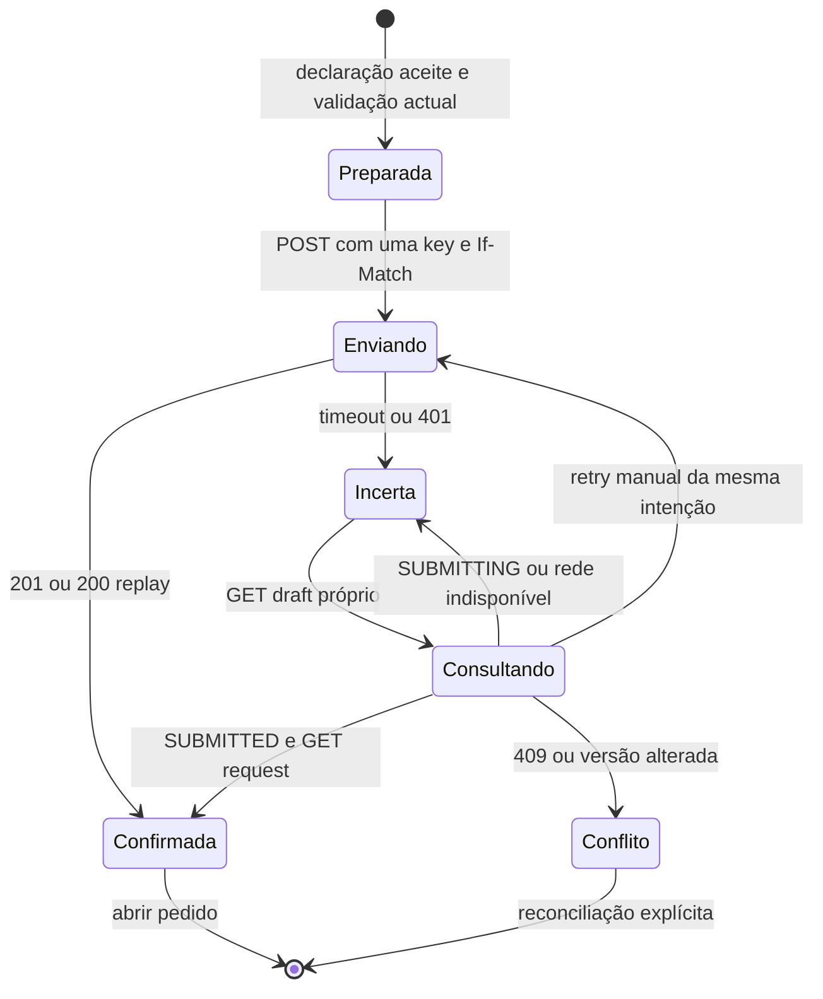

# WF-01 — estados, falhas e recuperação sem perda silenciosa

**Base:** `BOANE_CONECTA_CR01_REQUEST_CONTRACT.md`, controllers `CitizenRequestDraftController`, `CitizenRequestSubmissionController`, `CitizenDocumentController`, FE-01 `frontend/src/lib/api.ts`. Rotas REST abreviadas usam prefixo `/api/v1/citizen`. Nenhum cenário aqui constitui teste E2E executado.

| Evento | Ecrãs | Evidência do servidor / reação UX | Integridade dos dados |
| --- | --- | --- | --- |
| `401` GET | S01–S08 | Refresh FE-01 no máximo uma vez, repetir só GET; se impossível, login com destino validado. | Não exibir cache de outra conta; não reportar estado desconhecido como guardado. |
| `401` em escrita | S01–S06 | FE-01 actual refresca sessão mas **não** repete mutação; reautenticar e consultar o recurso antes de qualquer retry. | POST pode ter tido efeito; conservar intenção e chave de submit; não fazer segundo POST com key nova. |
| `403` papel | Todos privados | Acesso negado, link seguro para área do próprio papel. | Não mostrar resumo parcial de dados citizen. |
| `404` recurso ou outro dono | S01, S02–S08 | Mensagem genérica “Recurso indisponível”; não distinguir ID ausente de ID alheio. | Não navegar automaticamente para `:id` de pedido submetido. |
| `400` pedido malformado | S02–S05 | Associar apenas erros de `/validate` com `stepKey/fieldKey/requirementKey`; outros 400 usam mensagem segura e não inventam nomes de campo. | Manter respostas em memória para correção; backend prevalece. |
| `409` ETag obsoleto | S02–S05 | Parar fila de escrita, GET draft/links/definição; mostrar “Outra alteração foi guardada. Compare antes de continuar.” | Conservar edição local não confirmada; comparação por campo ou requisito, escolha explícita do utilizador; nova escrita só com ETag novo e payload revisto. |
| `409` draft expirado/abandonado | S02–S06 | GET mostra status/`expiresAt` quando permitido; informar que já não aceita edição. | Sem recriar draft com as respostas anteriores automaticamente. |
| Definição incompatível | S02–S05/S08 | `formVersionId`/`serviceVersionId` do draft diverge da definição publicada; mostrar “Não é possível carregar a versão deste rascunho.” | Bloquear campos/revisão/submit; não usar schema/declaração da versão nova. Backend precisa de leitura da versão fixada para retoma completa (C1). |
| Campo oculto por condição | S03 | `visibleWhen` muda a vista; mostrar apenas campos visíveis. | Valor oculto segue exactamente `CLEAR_ON_HIDE` ou `PRESERVE_ON_HIDE` do schema e validação backend; não apagar dados de outro campo sem confirmação de PATCH. |
| Upload incerto | S04 | Reconsultar `GET /documents`/`{id}` e anexos do draft; se impossível identificar ficheiro, indicar que upload pode ter ocorrido. | Não repetir automaticamente POST multipart, nem apagar documentos possivelmente carregados. |
| `RECEIVED`/`SCANNING` | S04/S05 | Estado textual, leitura periódica moderada só enquanto visível; não associar antes de `VALID`. | A validação/submissão permanece bloqueada. |
| `REJECTED`/`EXPIRED` | S04/S05 | Mensagem segura e ação de selecionar outro ficheiro; sem preview automático. | Ligação existente, se houver, não conta como válida; substituição só após novo ficheiro `VALID`. |
| Versão de declaração diferente | S05/S06 | 409, voltar a obter definição **fixada**; requer aceitação explícita de texto correcto. | Não reusar aceitação de texto diferente e não trocar a versão no payload mantendo mesma key. |
| Validação inválida | S05 | `POST /validate` devolve `valid=false` + listas; foco no resumo ligado aos controlos. | Só prosseguir após correção, novo save e nova validação; a declaração continua desmarcada se conteúdo mudou. |
| Resultado desconhecido/timeout submit | S06 | GET draft; se `SUBMITTED`+`submittedRequestId`, GET request próprio; se `SUBMITTING`/incerto, aguardar/consultar; se editável, oferecer retry **da mesma key, payload e If-Match**, sujeito a confirmação de estado e limite manual. | Não gerar key nova nem considerar timeout falha definitiva; 409 no retry pede reconciliação, sem avançar S07 por suposição. |
| Replay confirmado | S06/S07 | POST devolve 200 + `replayed=true`; confirmar mesmo request ID, depois limpar key após estado seguro. | Nunca duplicar recibo/pedido, não repetir outros POST. |
| Reload S07 | S07 | GET draft `SUBMITTED` + GET request; sem GET confirmado, estado de resolução. | A resposta transitória não basta para comprovativo durável. |

## Máquina de intenção de submissão

Um `GET` de draft ainda editável após timeout **não prova** que o POST não está em curso. Retry manual sempre com a mesma key/payload/version; se houve mudança de versão ou declaração, parar, reconciliar e só criar intenção nova quando houver certeza documentada de que a anterior não produziu um pedido. Registar timestamps de início/última tentativa sem tokens nem dados pessoais. `Idempotency-Key` por intenção e por conta; limpar após confirmação ou logout verificado, mas não perder a key só por reload da página. O backend mantém registo de idempotência 7 dias segundo `RequestSubmissionService`; cliente não promete recuperação indefinida.

## Matriz de validação futura

| Gate FE-03/FE-04 | Prova exigida |
| --- | --- |
| Concorrência | Duas abas no mesmo draft; 409, edição local preservada, reconciliação manual e novo If-Match correcto. |
| Idempotência | Dois cliques, timeout e reload; um `requestId` confirmado, mesmo key no replay 200. |
| Acesso | Anónimo/staff negados; Citizen B não lê nem muta draft/documento/pedido de Citizen A (404), com contas QA descartáveis. |
| Versão | Draft fixado com versão antiga não renderiza formulário novo; após endpoint de versão fixada, mostra dados antigos correctos. |
| Scanner | `RECEIVED`, `SCANNING`, `VALID`, `REJECTED`, `EXPIRED`; só `VALID` anexa e valida. |
| Sessão | GET retoma após refresh; mutação 401 não repetida automaticamente; reauth conserva rota permitida. |
| Acessibilidade | Foco no título/resumo, ordem lógica, `aria-describedby`, anúncios moderados, 200% zoom e 320px. |

## Estados FE-04b implementados

`preparing → sending → submitted` apenas com confirmação do backend; `sending → checking → submitted` quando o GET próprio comprova commit; `sending → checking → unknown` quando ainda não há prova; `checking → conflict` se ETag, expiração ou estado invalidam a intenção. `unknown → checking` é uma acção explícita. Só em `unknown`, depois de GET que verifica ETag/estado, há repetição manual do POST com a chave/payload/If-Match originais. `conflict` preserva a intenção e pede reconciliação. S07 sempre reconstrói a confirmação por GET após reload. Alterações posteriores a S05 anulam a sua aceitação transitória pelo ETag; a versão publicada nova não substitui a definição fixada. Consulte `BOANE_CONECTA_FE04B_SUBMISSION_STATE_MACHINE.md` para matriz de transições e riscos.
